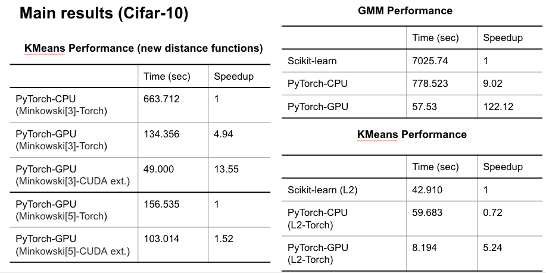
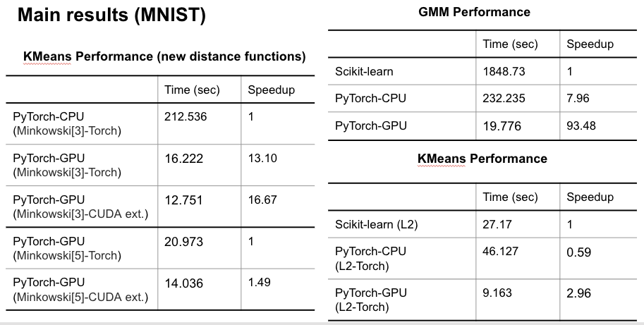

# Performance measurement of clustering applications in ML with GPU acceleration using CUDA

This is the repository for 2021 Spring HPML class project. 

## Introduction

* Motivation:
  * Accelerate clustering algorithms on large-scale datasets.
* Challenge:
  * Dataset: large-scale data points
  * Algorithm: 
    * Parallel computation of distance matrix (bottle neck).
    * Parallel updates of parameters.
    * Specifically designed distance kernel functions.
  * System:
    *  PyTorch implementation VS Scikit Learn Library.
    * CUDA extended PyTorch implementation.
* Contribution:
  * PyTorch implementations of clustering algorithms (GPU/CPU).
  * CUDA extensions of specifically designed distance kernel functions.
  * CUDA extensions called from PyTorch runtime.
  * Evaluated on large-scale clustering benchmarks.
* Datasets: 
  * MNIST
  * Cifar-10
* Algorithms:
  * K-means
    1. Sklearn
    2. Pytorch-cpu
    3. Pytorch-gpu-l2
    4. Pytorch-gpu-Minkowski
  * GMM
    1. Sklearn
    2. Pytorch-cpu
    3. pytorch-gpu
* Metric
  * Total time
  * Speedup

## Instruction

The scripts are separate implementions based on different frames.

1. `_kmeans_skl.py`: Sklearn implementation of KMeans.
2. `_kmeans.py`: Pytorch CPU & GPU implementation of KMeans
3. `_gmm_skl.py`: sklearn implementation of GMM.
4. `_gaussian.py`: Pytorch CPU & GPU implementation of GMM
5. `/cuda/my_cuda_kernel.cu`: CUDA implementation of L2 & Minkowski kernels

Run and profile the scripts using:

1. Sklearn: Modify script to test on specific dataset, and run with `time python _[kmeans/gmm]_skl.py`

## Results and Observations

* **KMeans**
  * Our PyTorch implementation on CPU is less efficient than sklearn.
  * Speedup of GPU (PyTorch) on conventional kernel function (**L2**) is up to **5×**.
  * Speedup of GPU (PyTorch) on **special kernels** is up to **13×**.
  * Speedup of GPU (PyTorch) with **CUDA kernel extension** can be up to **16×**. 
* **GMM**
  * GMM is relatively **more computation intensive**.
  * Speedup of our PyTorch implementation on CPU can be up to **9×**.
  * This speedup can be the best utilisation of **multi-thread computing**. 
  * Speedup of GPU (PyTorch) can be up to **122×**.
* Partial results:

